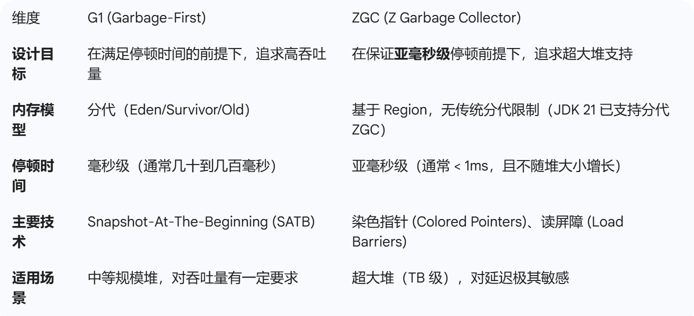

> ## 为什么说是几乎所有对象实例都存在于堆中呢？ 
> 这是因为 HotSpot 虚拟机引入了 JIT 优化之后，会对对象进行逃逸分析，如果发现某一个对象并没有逃逸到方法外部，那么就可能通过标量替换来实现栈上分配，而避免堆上分配内存. 
> 基本数据类型存放在栈中是一个常见的误区！  
> 基本数据类型的存储位置取决于它们的作用域和声明方式。如果它们是局部变量，那么它们会存放在栈中；如果它们是成员变量，那么它们会存放在堆/方法区/元空间中。

> ## jdk21
> ### G1和ZGC的区别
> 
> ### ZGC垃圾回收过程
> #### 标记阶段(染色指针: 黑色:已扫描,不会被回收. 灰度:扫描中. 白色:已扫描,是垃圾. 读屏障: 业务线程修改白色对象, 会将其修改为灰色, 以便gc线程重新扫描)
> 初始标记：使用STW的方式，暂停Mutator，完成从根集合出发到堆内对象的标记。  
> 并发标记：将根集合识别出的活跃对象作为并发标记的起点，完成整个堆空间内活跃对象的标记。  
> 再标记：使用STW的方式，暂停Mutator，再次完成根集合到整个堆内空间的标记。再标记主要是为了解决某些Mutator在并发标记阶段因各种因素，无法执行新增根集合到堆空间的标记的问题。  
> 弱根标记：此阶段处理弱根（包括Java语言中的引用），弱根处理的目的是将标记阶段识别出来的对象再次进行标记处理，确定这些对象是否真的活跃   
> #### 转移阶段
> 初始转移：使用STW的方式，暂停Mutator，完成从根集合出发到堆内转移集合对象（即对象必须位于转移页面）的转移；根集合中引用到的不在转移集合中的对象则不会转移。  
> 并发转移：根据选择的转移集合，对其中的活跃对象进行转移。  
> ### ZGC 处理大对象的“核心优势”
> A. 极致的并发能力（解决停顿问题）  
> ZGC 不管对象有多大，它的标记、重定位都是并发进行的 。  
> 读屏障的“自愈”：即使是一个几百 MB 的大对象，当 GC 线程移动它时，ZGC 不会像 G1 那样试图在停顿中搬运完毕。而是由读屏障拦截业务读取操> 作，将指针“慢慢”修正。这使得即便大对象搬运需要较长时间，也不会导致系统停顿 。  
> B. 染色指针的“空间高效性”   
> ZGC 不需要通过对象头来标记状态，这意味着在处理复杂对象图的大对象时，GC 的开销不会随着对象规模的增加而线性增长 。  
> C. 分配策略更灵活   
> ZGC 的 Region 是动态大小的，它可以更好地容纳大对象，减少了 G1 那种为了分配大对象而必须连续合并 Region 的硬性要求 。  
> 
> ## 虚拟线程
> #### 优点和缺点
> 极致的轻量级与内存友好： 
> 传统平台线程是操作系统线程的 1:1 映射，每个线程通常需> 要 1MB 的栈空间。 
> 虚拟线程是用户态线程，初始内存占用仅为几百字节，可以> 轻松创建数百万个实例而不会撑爆内存。 
> 
> 大幅提升 I/O 密集型应用的吞吐量： 
> 当虚拟线程执行 I/O 操作时，它会被自动挂起并从底层物理> 线程“卸载”，释放物理线程去处理其他任务。 
> 这使得应用程序可以处理远超 CPU 核心数的并发请求，非常> 适合酒店搜筛这种频繁调用外部接口、数据库的 I/O 密集型> 场景。 
> 
> 保持同步编程模型： 
> 相比于异步回调（Callback）或响应式编程（如 WebFlux），虚拟线程让你可以继续使用直观的同步写法。这极大地降低了代码的调试、维护和堆栈跟踪难度。 
>
> CPU 密集型任务收益极小：
> 如果你的任务是纯计算型的（如加密、图像处理），虚拟线> 程无法像 I/O 任务那样高效卸载，反而会因为线程调度开销> 而导致性能下降。
> 
> 不兼容 ThreadLocal 的滥用：
> 由于虚拟线程数量极多，如果开发者在虚拟线程中大量使用 ThreadLocal 存储数据，会迅速消耗大量内存，甚至导致 OutOfMemoryError。
> 
> “Pinning” (挂起) 问题：
> 在某些特定情况下（如执行 synchronized 块或某些 Native 方法时），虚拟线程会被“固定”在物理线程上，无 法卸载。这会导致物理线程被阻塞，丧失了虚拟线程并发的 优势。
>
> 死锁问题:
> 同时使用synchronized和ReentrantLock会引起死锁
> 
> 需要运行环境适配：
> 尽管 API 层面兼容，但底层框架（如数据库连接池、HTTP > 客户端）如果不是为了高并发设计的，可能会在极端并发下> 成为性能瓶颈。